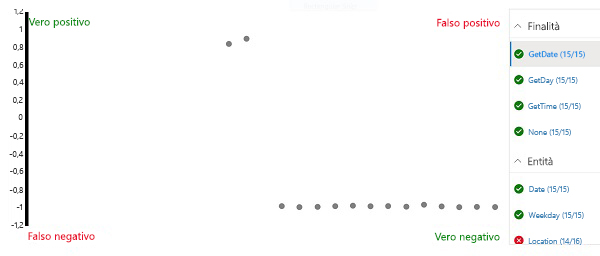

---
lab:
  title: Creare un'app Language Understanding
  module: Module 5 - Creating Language Understanding Solutions
ms.openlocfilehash: d8a32a2b6404e81d8a5d69cef874fad209de1bfc
ms.sourcegitcommit: d6da3bcb25d1cff0edacd759e75b7608a4694f03
ms.translationtype: HT
ms.contentlocale: it-IT
ms.lasthandoff: 11/16/2021
ms.locfileid: "132625986"
---
# <a name="create-a-language-understanding-app"></a>Creare un'app Language Understanding

Il servizio Language Understanding consente di definire un'app che incapsula un modello linguistico che le applicazioni possono usare per interpretare l'input in linguaggio naturale degli utenti, prevedere la *finalità* degli utenti, ossia cosa vogliono ottenere, e identificare le *entità* a cui applicare la finalità.

Ad esempio, un'app basata su Language Understanding per un'applicazione orologio potrebbe elaborare input simile al seguente:

*What is the time in London?*

Questo tipo di input è un esempio di *espressione* (qualcosa che un utente potrebbe dire o digitare) la cui *finalità* è recuperare l'orario in una località specifica (un'*entità* ), in questo caso Londra.

> **Nota**: l'attività dell'app di Language Understanding è prevedere la finalità dell'utente e identificare le entità a cui si applica. <u>Non</u> è eseguire effettivamente le azioni necessarie per soddisfare la finalità. Ad esempio, l'applicazione orologio può usare un'app per il linguaggio per comprendere che l'utente vuole conoscere l'ora di Londra, ma è l'applicazione client stessa che deve quindi implementare la logica per determinare l'ora corretta e presentarla all'utente.

## <a name="clone-the-repository-for-this-course"></a>Clonare il repository per questo corso

Se il repository di codice **AI-102-AIEngineer** non è già stato clonato nell'ambiente in cui si sta lavorando a questo lab, seguire questa procedura per clonarlo. In caso contrario, aprire la cartella clonata in Visual Studio Code.

1. Avviare Visual Studio Code.
2. Aprire il riquadro comandi (MAIUSC+CTRL+P) ed eseguire un comando **Git: Clone** per clonare il repository `https://github.com/MicrosoftLearning/AI-102-AIEngineer` in una cartella locale (non importa quale).
3. Dopo la clonazione del repository, aprire la cartella in Visual Studio Code.
4. Attendere il completamento dell'installazione di file aggiuntivi per supportare i progetti in codice C# nel repository.

    > **Nota**: se viene richiesto di aggiungere gli asset necessari per la compilazione e il debug, selezionare **Non adesso**.

## <a name="create-language-understanding-resources"></a>Creare risorse di Language Understanding

Per usare il servizio Language Understanding, occorrono due tipologie di risorse:

- Una risorsa di *creazione*: usata per definire, sottoporre a training e testare l'app di Language Understanding. Deve essere una risorsa **Language Understanding - Creazione** nella tua sottoscrizione di Azure.
- Una risorsa di *previsione*: usata per pubblicare l'app di Language Understanding e gestire le richieste provenienti dalle applicazioni client che la usano. Questa può essere una risorsa **Language Understanding** o **Servizi cognitivi** nella tua sottoscrizione di Azure.

     > **Importante**: le risorse di creazione devono essere create in una delle tre *aree* geografiche (Europa, Australia o Stati Uniti). Le app di Language Understanding create in risorse di creazione europee o australiane possono essere distribuite rispettivamente solo in risorse di previsione in Europa o Australia; i modelli creati in risorse di creazione statunitensi possono essere distribuiti in risorse di previsione in qualsiasi località di Azure diversa da Europa e Australia. Consultare la [documentazione sulle aree di creazione e pubblicazione](https://docs.microsoft.com/azure/cognitive-services/luis/luis-reference-regions) per i dettagli su come abbinare le posizioni di creazione e previsione.

Se non si hanno già risorse di creazione e previsione di Language Understanding:

1. Aprire il portale di Azure all'indirizzo `https://portal.azure.com` ed eseguire l'accesso usando l'account Microsoft associato alla sottoscrizione di Azure.
2. Selezionare il pulsante **&amp;#65291;Crea una risorsa**, cercare *language understanding* e creare una risorsa di **Language Understanding** con le impostazioni seguenti.

    *Assicurarsi di selezionare **Language Understanding** e <u>non</u> Language Understanding (Servizi cognitivi di Azure)*

    - **Opzione Crea**: entrambe
    - **Sottoscrizione**: *la propria sottoscrizione di Azure*
    - **Gruppo di risorse**: *scegliere o creare un gruppo di risorse. Se si usa una sottoscrizione con restrizioni, si potrebbe non essere autorizzati a creare un nuovo gruppo di risorse. Usare quello fornito*
    - **Nome**: *immettere un nome univoco*
    - **Posizione di creazione**: *selezionare la posizione preferita*
    - **Piano tariffario di creazione**: F0
    - **Percorso di stima**: *uguale alla posizione di creazione*
    - **Piano tariffario per le previsioni**: F0
3. Attendere che vengano create le risorse e tenere presente che è stato effettuato il provisioning di due risorse di Language Understanding, una per la creazione e un'altra per la previsione. È possibile visualizzarle entrambe passando al gruppo di risorse in cui sono state create. Se si seleziona **Vai alla risorsa**, verrà aperta la risorsa di *creazione*.

## <a name="create-a-language-understanding-app"></a>Creare un'app basata su Language Understanding

Ora che è stata creata una risorsa di creazione, è possibile usarla per creare un'app di Language Understanding.

1. In una nuova scheda del browser aprire il portale di Language Understanding all'indirizzo `https://www.luis.ai`.
2. Accedere usando l'account Microsoft associato alla sottoscrizione di Azure. Se è la prima volta che accedi al portale di Language Understanding potresti dover concedere all'app alcuni permessi in modo che possa accedere ai dettagli del tuo account. Completare quindi i passaggi di *benvenuto* selezionando la sottoscrizione di Azure e la risorsa di creazione appena creata.

    > **Nota:** se l'account è associato a più sottoscrizioni in directory diverse, può essere necessario passare alla directory contenente la sottoscrizione in cui è stato effettuato il provisioning delle risorse di Language Understanding.

3. Nella pagina **Conversation Apps** (App di conversazione) verificare che siano selezionati la sottoscrizione e la risorsa di creazione di Language Understanding in uso. Quindi crea una nuova app per conversazioni con le impostazioni seguenti:
    - **Nome:** Orologio
    - **Impostazioni cultura**: Inglese (*se questa opzione non è disponibile, lasciare il campo vuoto*)
    - **Descrizione:** orologio in linguaggio naturale
    - **Risorsa di previsione**: *la risorsa di previsione di Language Understanding*

    Se l'app **Orologio** non viene aperta automaticamente, aprirla.
    
    Se compare un riquadro con dei consigli per creare un'app di Language Understanding efficace, chiudila.

## <a name="create-intents"></a>Creare finalità

La prima cosa da fare nella nuova app è definire alcune finalità.

1. Nella pagina **Finalità** selezionare **&#65291; Crea** per creare una nuova finalità denominata **GetTime**.
2. Nella finalità **GetTime** aggiungere le espressioni seguenti come input utente di esempio:

    *what is the time?*

    *what time is it?*

3. Dopo aver aggiunto queste espressioni, tornare alla pagina **Finalità** e aggiungere un'altra nuova finalità denominata **GetDay** con le espressioni seguenti:

    *what is the day today?*

    *what day is it?*

4. Dopo aver aggiunto queste espressioni, tornare alla pagina **Finalità** e aggiungere un'altra nuova finalità denominata **GetDate** con le espressioni seguenti:

    *what is the date today?*

    *what date is it?*

5. Dopo aver aggiunto queste espressioni, tornare alla pagina **Finalità** e selezionare la finalità **Nessuna**. Questa finalità viene fornita come fallback per l'input che non esegue il mapping ad alcuna delle finalità definite nel modello linguistico.
6. Aggiungere le espressioni seguenti alla finalità **Nessuna**:

    *hello*

    *goodbye*

## <a name="train-and-test-the-app"></a>Eseguire il training e il test dell'app

Ora che sono state aggiunte alcune finalità, è possibile eseguire il training dell'app e verificare se riesce a prevederle correttamente dall'input dell'utente.

1. In alto a destra nel portale selezionare **Esegui training**  per eseguire il training dell'app.
2. Al termine del training dell'app, selezionare **Test** per visualizzare il pannello Test e quindi immettere l'espressione di test seguente:

    *what's the time now?*

    Esaminare il risultato restituito, notando che include la finalità prevista (che dovrebbe essere **GetTime**) e un punteggio di attendibilità che indica la probabilità calcolata dal modello per la finalità prevista.

3. Provare l'espressione di test seguente:

    *tell me the time*

    Di nuovo, esaminare la finalità prevista e il punteggio di attendibilità.

4. Provare l'espressione di test seguente:

    *what's today?*

    Il modello dovrebbe prevedere la finalità **GetDay**.

5. Infine, provare questa espressione di test:

    *hi*

    Verrà restituita la finalità **Nessuna**.

6. Chiudere il pannello Test.

## <a name="add-entities"></a>Aggiungi entità

Finora sono stati definite alcune espressioni semplici associate a finalità. La maggior parte delle applicazioni reali include espressioni più complesse da cui è necessario estrarre entità di dati specifiche per ottenere più contesto per la finalità.

### <a name="add-a-machine-learned-entity"></a>Aggiungere un'entità *acquisita tramite apprendimento automatico*

Il tipo più comune di entità è un'entità *acquisita tramite apprendimento automatico*, in cui l'app impara a identificare i valori delle entità in base a esempi.

1. Nella pagina **Entità** selezionare **&#65291; Crea** per creare una nuova entità.
2. Nella finestra di dialogo **Crea entità** creare un'entità **acquisita tramite apprendimento automatico** denominata **Location**.
3. Dopo aver creato l'entità **Location**, tornare alla pagina **Finalità** e selezionare la finalità **GetTime**.
4. Immettere la nuova espressione di esempio seguente:

    *what time is it in London?*

5. Dopo aver aggiunto l'espressione, selezionare la parola ***london** _ e nell'elenco a discesa visualizzato selezionare _ *Location** per indicare che "london" è un esempio di località.
6. Aggiungere un'altra espressione di esempio:

    *what is the current time in New York?*

7. Dopo aver aggiunto l'espressione, selezionare le parole ***new york** _ ed eseguirne il mapping all'entità _ *Location**.

### <a name="add-a-list-entity"></a>Aggiungere un'entità *elenco*

In alcuni casi, i valori validi per un'entità possono essere limitati a un elenco di termini e sinonimi specifici. Questo consente all'app di identificare più facilmente le istanze dell'entità nelle espressioni.

1. Nella pagina **Entità** selezionare **&#65291; Crea** per creare una nuova entità.
2. Nella finestra di dialogo **Crea entità** creare un'entità **List** denominata **Weekday**.
3. Aggiungere i **valori normalizzati** e i **sinonimi** seguenti:

    | Valori normalizzati | sinonimi|
    |-------------------|---------|
    | sunday | sun |
    | monday | mon |
    | tuesday | tue |
    | wednesday | wed |
    | thursday | thu |
    | friday | fri |
    | saturday | sat |

3. Dopo aver creato l'entità **Weekday**, tornare alla pagina **Finalità** e selezionare la finalità **GetDate**.
4. Immettere la nuova espressione di esempio seguente:

    *what date was it on Saturday?*

5. Dopo aver aggiunto l'espressione, verificare che **saturday** sia stato mappato automaticamente all'entità **Weekday**. In caso contrario, selezionare la parola **_saturday_ *_ e nell'elenco a discesa visualizzato selezionare _* Weekday**.
6. Aggiungere un'altra espressione di esempio:

    *what date will it be on Friday?*

7. Dopo aver aggiunto l'espressione, verificare che **friday** sia mappato all'entità **Weekday**.

### <a name="add-a-regex-entity"></a>Aggiungere un'entità *Regex*

In alcuni casi le entità hanno un formato specifico, ad esempio un numero di serie, un codice di modulo o una data. È possibile definire un'espressione regolare (*regex*) che descrive un formato previsto per aiutare l'app a identificare i valori di entità corrispondenti.

1. Nella pagina **Entità** selezionare **&#65291; Crea** per creare una nuova entità.
2. Nella finestra di dialogo **Crea entità** creare un'entità **Regex** denominata **Date** con l'espressione regolare seguente:

    ```
    [0-9]{2}/[0-9]{2}/[0-9]{4}
    ```

    > **Nota**: questa è un'espressione regolare semplice che verifica la presenza di due cifre seguite da "/", altre due cifre, di nuovo "/" e quattro cifre, ad esempio *01/11/2020*. Consente date non valide, ad esempio *56/00/9999*, ma è importante ricordare che l'entità regex si usa per identificare un'immissione di dati *intesi* come data, non per convalidare i valori di data.

3. Dopo aver creato l'entità **Date**, tornare alla pagina **Finalità** e selezionare la finalità **GetDay**.
4. Immettere la nuova espressione di esempio seguente:

    *what day was 01/01/1901?*

5. Dopo aver aggiunto l'espressione, verificare che **01/01/1901** sia stato mappato automaticamente all'entità **Date**. In caso contrario, selezionare **_01/01/1901_ *_ e nell'elenco a discesa visualizzato selezionare _* Date**.
6. Aggiungere un'altra espressione di esempio:

    *what day will it be on 12/12/2099?*

7. Dopo aver aggiunto l'espressione, verificare che l'espressione **12/12/2099** sia mappata all'entità **Date**.

### <a name="retrain-the-app"></a>Eseguire di nuovo il training dell'app

Ora che è stato modificato il modello linguistico, è necessario ripetere il training e il test dell'app.

1. In alto a destra nel portale selezionare **Esegui il training** per ripetere il training dell'app.
2. Al termine del training dell'app, selezionare **Test** per visualizzare il pannello Test e quindi immettere l'espressione di test seguente:

    *what's the time in Edinburgh?*

3. Esaminare il risultato restituito, che dovrebbe prevedere la finalità **GetTime**. Selezionare quindi **Ispeziona** e nel pannello di ispezione aggiuntivo visualizzato esaminare la sezione **Entità ML**. Il modello dovrebbe aver previsto che "edinburgh" è un'istanza di un'entità **Location**.
4. Provare a testare le espressioni seguenti:

    *what date is it on Friday?*

    *what's the date on Thu?*

    *what was the day on 01/01/2020?*

5. Al termine del test chiudere il pannello di ispezione, ma lasciare aperto il pannello di test.

## <a name="perform-batch-testing"></a>Eseguire test in batch

È possibile usare il riquadro di test per testare singole espressioni in modo interattivo, ma per i modelli linguistici più complessi è in genere più efficiente eseguire *test del batch*.

1. In Visual Studio Code aprire il file **batch-test.json** nella cartella **09-luis-app.** Questo file è un documento JSON che contiene svariati test case per il modello linguistico dell'orologio creato.
2. Nel portale di Language Understanding selezionare **Pannello di test del batch** nel pannello Test. Selezionare quindi **&#65291; Importa** e importare il file **batch-test.json** assegnando il nome **clock-test**.
3. Nel pannello di test del batch eseguire il test **clock-test**.
4. Al termine del test, selezionare **Visualizza risultati**.
5. Nella pagina dei risultati esaminare la matrice di confusione che rappresenta i risultati delle previsioni. La matrice mostra previsioni di veri positivi, falsi positivi, veri negativi e falsi negativi per la finalità o l'entità selezionata nell'elenco a destra.

    

    > **Nota**: ogni espressione viene classificata come risultato *positivo* o *negativo* per ogni finalità. Ad esempio, "what time is it?" dovrebbe essere classificata come *positivo* per la finalità **GetTime** e *negativo* per la finalità **GetDate**. I punti nella matrice di confusione mostrano quali espressioni sono state previste correttamente (*vero*) ed erroneamente (*falso*) come *positivo* e *negativo* per la finalità selezionata.

6. Con la finalità **GetDate** selezionata, selezionare uno dei punti nella matrice di confusione per esaminare i dettagli della previsione, inclusi l'espressione e il punteggio di attendibilità. Selezionare quindi le finalità **GetDay**, **GetTime** e **Nessuna** e visualizzare i risultati della previsione. L'app dovrebbe aver eseguito correttamente la previsione delle finalità.

    > **Nota:** l'interfaccia utente potrebbe non cancellare i punti selezionati in precedenza.

7. Selezionare l'entità **Location** e visualizzare i risultati della previsione nella matrice di confusione. In particolare, notare le previsioni che erano *falsi negativi*: si tratta di casi in cui l'app non è riuscita a rilevare la località specificata nell'espressione, a indicare che potrebbe essere necessario aggiungere altre espressioni di esempio alle finalità e ripetere il training del modello.
8. Chiudere il pannello di test del batch.

## <a name="publish-the-app"></a>Pubblicare l'app

In un progetto reale si perfezionerebbero in modo iterativo le finalità e le entità, ripetendo il training e i test finché non si è soddisfatti delle prestazioni di previsione. Fatto questo, si procederebbe a pubblicare l'app in modo che possa essere usata da applicazioni client.

1. Nella parte superiore del portale di Language Understanding selezionare **Pubblica**.
2. Selezionare **Slot di produzione** e pubblicare l'app.
3. Al termine della pubblicazione, nella parte superiore del portale di Language Understanding selezionare **Gestisci**.
4. Nella pagina **Impostazioni** annotare l'**ID app**. Le applicazioni client ne avranno bisogno per usare l'app.
5. Nella pagina **Risorse di Azure** annotare la **Chiave primaria**, la **Chiave secondaria** e l'**URL dell'endpoint** della risorsa di previsione tramite cui è possibile utilizzare l'app. Le applicazioni client hanno bisogno dell'endpoint e di una delle chiavi per connettersi alla risorsa di previsione ed essere autenticate.
6. In Visual Studio Code, nella cartella **09-luis-app** selezionare il file batch **GetIntent.cmd** e visualizzare il codice all'interno. Questo script della riga di comando usa cURL per chiamare l'API REST di Language Understanding per l'applicazione e l'endpoint di previsione specificati.
7. Sostituire i valori segnaposto nello script con l'**ID app**, l'**URL dell'endpoint** e la **Chiave primaria** o la **Chiave secondaria** dell'app di Language Understanding. Salvare quindi il file aggiornato.
8. Fare clic con il pulsante destro del mouse sulla cartella **09-luis-app** e aprire un terminale integrato. Immettere quindi il comando seguente (assicurarsi di includere le virgolette):

    ```
    GetIntent "What's the time?"
    ```

9. Esaminare la risposta JSON restituita dall'app, che indicherà la finalità con il punteggio più alto prevista per l'input (che dovrebbe essere **GetTime**).
10. Provare il comando riportato di seguito:

    ```
    GetIntent "What's today's date?"
    ```

11. Esaminare la risposta e verificare che preveda la finalità **GetDate**.
12. Provare il comando riportato di seguito:

    ```
    GetIntent "What time is it in Sydney?"
    ```

13. Esaminare la risposta e verificare che includa un'entità **Location**.

14. Provare i comandi seguenti ed esaminare le risposte:

    ```
    GetIntent "What time is it in Glasgow?"
    ```

    ```
    GetIntent "What's the time in Nairobi?"
    ```

    ```
    GetIntent "What's the UK time?"
    ```
15. Provare altre varianti: l'obiettivo è generare almeno alcune risposte che prevedano correttamente la finalità **GetTime**, ma non riescano a rilevare un'entità **Location**.

    Tenere aperto il terminale. Vi si tornerà in un secondo momento.

## <a name="apply-active-learning"></a>Applicare l'*apprendimento attivo*

È possibile migliorare un'app di Language Understanding in base alle espressioni inviate all'endpoint in passato. Questa tecnica è detta *apprendimento attivo*.

Nella procedura precedente si è usato cURL per inviare richieste all'endpoint dell'app. Queste richieste includevano l'opzione per registrare le query, che consente all'app di tenerne traccia in modo da usarle per l'apprendimento attivo.

1. Nel portale di Language Understanding selezionare **Compila** e visualizzare la pagina **Controlla le espressioni di endpoint**. Questa pagina elenca le espressioni registrate che il servizio ha contrassegnato per la revisione.
2. Per tutte le espressioni per cui vengono previste correttamente la finalità e una nuova entità Location (non inclusa nelle espressioni di training originali), selezionare **&#10003;** per confermare l'entità e quindi usare l'icona **&#10514;** per aggiungere l'espressione alla finalità come esempio di training.
3. Trovare un esempio di espressione in cui la finalità **GetTime** è stata identificata correttamente, ma <u>non</u> è stata identificata un'entità **Location**. Selezionare il nome della località ed eseguire il mapping all'entità **Location**. Usare quindi l'icona **&#10514;** per aggiungere l'espressione alla finalità come esempio di training.
4. Passare alla pagina **Finalità** e aprire la finalità **GetTime** per verificare che le espressioni suggerite siano state aggiunte.
5. Nella parte superiore del portale di Language Understanding selezionare **Esegui il training**  per ripetere il training dell'app.
6. In alto a destra nel portale di Language Understanding selezionare **Pubblica** e ripubblicare l'app nello **Slot di produzione**.
7. Tornare al terminale della cartella **09-luis-app** e usare il comando **GetIntent** per inviare l'espressione aggiunta e corretta durante l'apprendimento attivo.
8. Verificare che il risultato ora includa l'entità **Location**. Provare quindi un'altra espressione che usi la stessa formulazione, ma specifichi una località diversa, ad esempio *Berlin*.

## <a name="export-the-app"></a>Esportare l'app

È possibile usare il portale di Language Understanding per sviluppare e testare l'app per il linguaggio, ma in un processo di sviluppo software per DevOps è necessario mantenere una definizione dell'app con controllo del codice sorgente che si possa includere nelle pipeline di integrazione continua e recapito continuo (CI/CD). Sebbene sia *possibile* usare l'API REST o l'SDK di Language Understanding negli script di codice per creare ed eseguire il training dell'app, un modo più semplice è usare il portale per creare l'app e quindi esportarla come file con estensione *lu* che si potrà importare e sottoporre di nuovo a training in un'altra istanza di Language Understanding. Questo approccio consente di sfruttare i vantaggi del portale in termini di produttività, mantenendo al tempo stesso la portabilità e la riproducibilità dell'app.

1. Nel portale di Language Understanding selezionare **Gestisci**.
2. Nella pagina **Versioni** selezionare la versione corrente dell'app (ne dovrebbe essere presente una sola).
3. Nell'elenco a discesa **Esporta** selezionare **Esporta come LU**. Quando richiesto dal browser, salvare il file nella cartella **09-luis-app**.
4. In Visual Studio Code aprire il file con estensione **lu** appena esportato e scaricato (se viene richiesto di cercare nel marketplace un'estensione in grado di leggerlo, ignorare la richiesta). Si noti che il formato LU è leggibile e per questo rappresenta un sistema efficace per documentare la definizione dell'app di Language Understanding in un ambiente di sviluppo in team.

## <a name="more-information"></a>Altre informazioni

Per altre informazioni sull'uso del servizio **Language Understanding**, vedere la [documentazione di Language Understanding](https://docs.microsoft.com/azure/cognitive-services/luis/).
