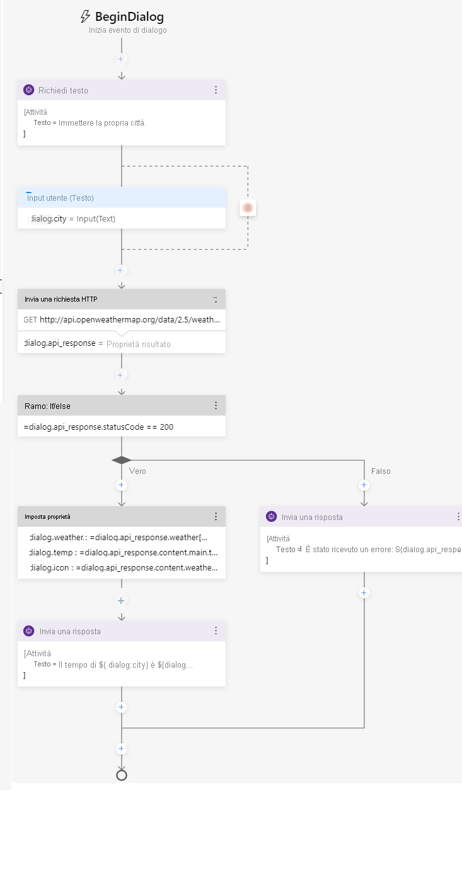

---
lab:
  title: Creare un bot con Bot Framework Composer
  module: Module 7 - Conversational AI and the Azure Bot Service
ms.openlocfilehash: f25609df8d9abc29e691bd83d0470561c9e3e4b0
ms.sourcegitcommit: b934aa694b86756d8b297a384cc6b707f0536e57
ms.translationtype: HT
ms.contentlocale: it-IT
ms.lasthandoff: 12/08/2021
ms.locfileid: "134300687"
---
# <a name="create-a-bot-with-bot-framework-composer"></a>Creare un bot con Bot Framework Composer

Bot Framework Composer è uno strumento di progettazione grafica che consente di creare bot di conversazione sofisticati in modo semplice e rapido senza scrivere codice. Composer è uno strumento open source che offre un canvas visivo per la creazione di bot.

## <a name="prepare-to-develop-a-bot"></a>Eseguire la preparazione per lo sviluppo di un bot

Per iniziare, preparare i servizi e gli strumenti necessari per sviluppare un bot.

### <a name="get-an-openweather-api-key"></a>Ottenere una chiave API OpenWeather

In questo esercizio verrà creato un bot che usa il servizio OpenWeather per recuperare le condizioni meteo per la città immessa dall'utente. Per il funzionamento del servizio è necessaria una chiave API.

1. In un Web browser passare al sito OpenWeather all'indirizzo `https://openweathermap.org/price`.
2. Richiedere una chiave API gratuita e creare un account OpenWeather (se non se ne ha già uno).
3. Dopo la registrazione, aprire la pagina **Chiavi API** per visualizzare la chiave API.

### <a name="update-bot-framework-composer"></a>Aggiornare Bot Framework Composer

Per creare il bot si userà Bot Framework Composer. Questi strumenti vengono aggiornati regolarmente, quindi è necessario assicurarsi che sia installata la versione più recente.

> **Nota**: gli aggiornamenti possono includere modifiche all'interfaccia utente che influiscono sulle istruzioni in questo esercizio.

1. Avviare **Bot Framework Composer** e, se non viene richiesto automaticamente di installare un aggiornamento, usare l'opzione **Cerca aggiornamenti** del menu **?** per controllare la disponibilità di aggiornamenti.
2. Se è disponibile un aggiornamento, scegliere l'opzione per installarlo alla chiusura dell'applicazione. Chiudere quindi Bot Framework Composer e installare l'aggiornamento per l'utente attualmente connesso, riavviando la soluzione al termine dell'installazione. L'installazione può richiedere alcuni minuti.
3. Assicurarsi che la versione di Bot Framework Composer sia **2.0.0** o successiva.

## <a name="create-a-bot"></a>Creare un bot

A questo punto è possibile usare Bot Framework Composer per creare un bot.

### <a name="create-a-bot-and-customize-the-welcome-dialog-flow"></a>Creare un bot e personalizzare il flusso di dialogo di benvenuto

1. Avviare Bot Framework Composer, se non è già aperto.
2. Nella schermata **Home** selezionare **Nuovo**. Creare quindi un nuovo bot vuoto, denominarlo **WeatherBot** e salvarlo in una cartella locale.
3. Chiudere il riquadro **Per iniziare**, se viene aperto, e quindi nel riquadro di spostamento a sinistra selezionare **Messaggio di saluto** per aprire l'area del contenuto e visualizzare l'attività *ConversationUpdate* che viene chiamata quando un utente prende parte a una conversazione con il bot per la prima volta. L'attività è costituita da un flusso di azioni.
4. Nel riquadro delle proprietà a destra modificare il titolo **Messaggio di saluto** selezionando la parola **Messaggio di saluto** nella parte superiore del riquadro e modificandola in **WelcomeUsers**.
5. Nell'area del contenuto selezionare l'azione **Invia una risposta**. Nel riquadro delle proprietà modificare quindi il testo predefinito da *Hi to your bot* a `Hi! I'm WeatherBot.`
6. Nell'area del contenuto selezionare il simbolo **+** finale, appena sopra il cerchio che segnala la <u>fine</u> del flusso di dialogo, e aggiungere una nuova azione **Poni una domanda** per una risposta di tipo **Testo**.

    La nuova azione crea due nodi nel flusso di dialogo. Il primo nodo definisce un prompt con cui il bot pone una domanda all'utente, mentre il secondo nodo rappresenta la risposta che l'utente riceve. Nel riquadro delle proprietà, a questi nodi corrispondono le schede **Risposta del bot** e **Input dell'utente**.

7. Nella scheda **Risposta del bot** del riquadro delle proprietà aggiungere una risposta con il testo `What's your name?`. Nella scheda **Input dell'utente** impostare quindi il valore di **Proprietà** su `user.name` per definire una variabile a cui è possibile accedere in un secondo momento durante la conversazione con il bot.
8. Tornare all'area del contenuto, selezionare il simbolo **+** sotto l'azione **Input dell'utente (testo)** appena aggiunta e aggiungere un'azione **Invia una risposta**.
9. Selezionare l'azione **Invia una risposta** appena aggiunta e nel riquadro delle proprietà impostare il valore di testo su `Hello ${user.name}, nice to meet you!`.

    Il flusso di attività completato avrà l'aspetto seguente:

    

### <a name="test-the-bot"></a>Testare il bot

Il bot di base è completato ed è ora possibile eseguirne il test.

1. Selezionare **Avvia bot** nell'angolo in alto a destra di Composer e attendere la compilazione e l'avvio del bot. Questa operazione può richiedere alcuni minuti.

    - Se viene visualizzato un messaggio di Windows Firewall, abilitare l'accesso per tutte le reti.

2. Nel riquadro **Gestione runtime del bot locale** selezionare **Apri chat Web**.
3. Dopo una breve pausa, nel riquadro della chat Web **WeatherBot** verranno visualizzati il messaggio di benvenuto e la richiesta di immissione del nome.  Immettere il nome e premere **INVIO**.
4. Il bot risponderà con **Hello *nome_utente*, nice to meet you!** .
5. Chiudere il pannello della chat Web.
6. In alto a destra in Composer, accanto a **&#8635; Riavvia bot**, fare clic su **<u>=</u>** per aprire il riquadro **Gestione runtime del bot locale** e usare l'icona ⏹ per arrestare il bot.

## <a name="add-a-dialog-to-get-the-weather"></a>Aggiungere un dialogo per ottenere informazioni meteo

Ora che si ha un bot funzionante, è possibile espanderne le funzionalità aggiungendo dialoghi per interazioni specifiche. In questo caso, si aggiunge un dialogo che viene attivato quando l'utente menziona il termine "weather".

### <a name="add-a-dialog"></a>Aggiungere un dialogo

In primo luogo, è necessario definire un flusso di dialogo che viene usato per gestire le domande sul meteo.

1. In Composer, nel riquadro di spostamento spostare il mouse sul nodo di primo livello (**WeatherBot**) e nel menu **...** selezionare **+ Aggiungi un dialogo** come illustrato di seguito:

    

    Creare quindi un nuovo dialogo denominato **GetWeather** con la descrizione **Get the current weather condition for the provided zip code**.
2. Nel riquadro di spostamento selezionare il nodo **BeginDialog** per il nuovo dialogo **GetWeather**. Nell'area del contenuto usare quindi il simbolo **+** per aggiungere un'azione **Poni una domanda** per una risposta di tipo **Testo**.
3. Nella scheda **Risposta del bot** del riquadro delle proprietà aggiungere la risposta `Enter your city.`
4. Nella scheda **Input dell'utente** impostare il campo **Proprietà** su `dialog.city` e il campo **Formato di output** sull'espressione `=trim(this.value)` per rimuovere eventuali spazi superflui intorno al valore fornito dall'utente.

    Il flusso di attività eseguito finora sarà simile al seguente:

    

    Fino a questo momento, il dialogo chiede all'utente di immettere una città. A questo punto è necessario implementare la logica per recuperare le informazioni meteo per la città immessa.

6. Nell'area del contenuto, direttamente sotto l'azione **Input dell'utente** relativa all'inserimento della città, selezionare il simbolo **+** per aggiungere una nuova azione.
7. Dall'elenco delle azioni selezionare **Access external resources** (Accedi a risorse esterne) e quindi **Invia una richiesta HTTP**.
8. Impostare le proprietà relative a **Richiesta HTTP** come indicato di seguito, sostituendo **YOUR_API_KEY** con la chiave API [OpenWeather](https://openweathermap.org/price):
    - **Metodo HTTP**: GET
    - **URL**: `http://api.openweathermap.org/data/2.5/weather?units=metric&q=${dialog.city}&appid=YOUR_API_KEY`
    - **Proprietà risultato**: `dialog.api_response`

    Il risultato può includere una delle quattro proprietà seguenti della risposta HTTP:

    - **statusCode**. Accesso eseguito tramite **dialog.api_response.statusCode**.
    - **reasonPhrase**. Accesso eseguito tramite **dialog.api_response.reasonPhrase**.
    - **content**. Accesso eseguito tramite **dialog.api_response.content**.
    - **headers**. Accesso eseguito tramite **dialog.api_response.headers**.

    Inoltre, se il tipo di risposta è JSON, sarà un oggetto deserializzato disponibile tramite la proprietà **dialog.api_response.content**. Per informazioni dettagliate sull'API OpenWeather e sulla risposta restituita, vedere la [documentazione dell'API OpenWeather](https://openweathermap.org/current).

    A questo punto è necessario aggiungere la logica al flusso di dialogo che gestisce la risposta, che può indicare l'esito positivo o negativo della richiesta HTTP.

9. Nell'area del contenuto, sotto l'azione **Invia una richiesta HTTP** creata, aggiungere un'azione **Crea una condizione** > **Ramo: if/else**. Questa azione definisce un ramo nel flusso di dialogo con i percorsi **True** e **False**.
10. Nel riquadro **Proprietà** dell'azione del ramo impostare il campo **Condizione** per scrivere l'espressione seguente:

    ```
    =dialog.api_response.statusCode == 200
    ```

11. Se la chiamata ha avuto esito positivo, è necessario archiviare la risposta in una variabile. Nell'area del contenuto, nel ramo **True** aggiungere un'azione **Gestisci proprietà** > **Imposta proprietà**. Nel riquadro delle proprietà aggiungere quindi le assegnazioni di proprietà seguenti:

    | Proprietà | Valore |
    | -- | -- |
    | `dialog.weather` | `=dialog.api_response.content.weather[0].description` |
    | `dialog.temp` | `=round(dialog.api_response.content.main.temp)` |
    | `dialog.icon` | `=dialog.api_response.content.weather[0].icon` |

12. Sempre nel ramo **True** aggiungere un'azione **Invia una risposta** sotto l'azione **Imposta una proprietà** e impostare il testo su:

    ```
    The weather in ${dialog.city} is ${dialog.weather} and the temperature is ${dialog.temp}&deg;.
    ```

    ***Nota**: questo messaggio usa le proprietà **dialog.city**, **dialog.weather** e **dialog.temp** impostate nelle azioni precedenti. Successivamente, si userà anche la proprietà **dialog.icon**.*

13. È anche necessario poter gestire una risposta del servizio meteo diversa da 200, quindi nel ramo **False** aggiungere un'azione **Invia una risposta** e impostare il testo su `I got an error: ${dialog.api_response.content.message}.`

    Il flusso del dialogo sarà ora simile al seguente:

    

### <a name="add-a-trigger-for-the-dialog"></a>Aggiungere un trigger per il dialogo

A questo punto è necessario trovare un modo per avviare il nuovo dialogo dal dialogo di benvenuto esistente.

1. Nel riquadro di spostamento selezionare il dialogo **WeatherBot** che contiene **WelcomeUsers** (si trova sotto il nodo di primo livello con lo stesso nome).

    

2. Nel riquadro delle proprietà relativo al dialogo **WeatherBot** selezionato, nella sezione **Language Understanding** impostare **Tipo di riconoscimento** su **Riconoscimento espressione regolare**.

    > Il tipo di riconoscimento predefinito usa il servizio Language Understanding per produrre la finalità dell'utente usando un modello di comprensione del linguaggio naturale. In questo caso viene usato un sistema di riconoscimento delle espressioni regolari per semplificare l'esercizio. In un'applicazione reale è consigliabile usare Language Understanding per ottenere un riconoscimento della finalità più sofisticato.

3. Nel menu **...** per il dialogo **WeatherBot** selezionare **Aggiungi un trigger**.

    

    Creare quindi un trigger con le impostazioni seguenti:

    - **What is the type of this trigger?** (Qual è il tipo di questo trigger): Finalità riconosciuta
    - **Qual è il nome di questo trigger (RegEx)** : `WeatherRequested`
    - **Immettere un criterio regEx**: `weather`

    > Il testo immesso nella casella di testo relativa al criterio regex è un semplice modello di espressione regolare che fa sì che il bot cerchi la parola *weather* in ogni messaggio in arrivo.  Se la parola "weather" è presente, il messaggio diventa una **finalità riconosciuta** e il trigger viene avviato.

4. Ora che il trigger è stato creato, è necessario configurare un'azione. Nell'area del contenuto per il trigger selezionare il simbolo **+** sotto il nodo del nuovo trigger **WeatherRequested**. Nell'elenco delle azioni selezionare quindi **Gestione del dialogo** e poi **Inizia un nuovo dialogo**.
5. Con l'azione **Inizia un nuovo dialogo** selezionata, nel riquadro delle proprietà selezionare il dialogo **GetWeather** nell'elenco a discesa **Nome dialogo** per avviare il dialogo **GetWeather** definito in precedenza quando è stato riconosciuto il trigger **WeatherRequested**.

    Il flusso di attività di **WeatherRequested** avrà l'aspetto seguente:

    

6. Riavviare il bot e aprire il riquadro della chat Web. Riavviare quindi la conversazione e, dopo aver immesso il nome, immettere `What is the weather like?`. Quando richiesto, immettere quindi una città, ad esempio `Seattle`. Il bot contatta il servizio e deve rispondere con un breve bollettino meteo.
7. Al termine del test, chiudere il riquadro della chat Web e arrestare il bot.

## <a name="handle-interruptions"></a>Gestire le interruzioni

Un bot ben progettato deve consentire agli utenti di modificare il flusso della conversazione, ad esempio annullando una richiesta.

1. In Bot Composer, nel riquadro di spostamento, usare il menu **...** per il dialogo **WeatherBot** per aggiungere un nuovo trigger (oltre ai trigger **WelcomeUsers** e **WeatherRequested** esistenti). Il nuovo trigger avrà le impostazioni seguenti:

    - **What is the type of this trigger?** (Qual è il tipo di questo trigger): Finalità riconosciuta
    - **Qual è il nome di questo trigger (RegEx)** : `CancelRequest`
    - **Immettere un criterio regEx**: `cancel`

    > Il testo immesso nella casella di testo relativa al criterio regex è un semplice modello di espressione regolare che fa sì che il bot cerchi la parola *cancel* in ogni messaggio in arrivo.

2. Nell'area del contenuto per il trigger aggiungere un'azione **Invia una risposta** e impostarne la risposta di testo su `OK. Whenever you're ready, you can ask me about the weather.`
3. Sotto l'azione **Invia una risposta** aggiungere una nuova azione per terminare il dialogo selezionando **Gestione del dialogo** e **Termina questo dialogo**.

    Il flusso del dialogo **CancelRequest** avrà l'aspetto seguente:

    

    Ora che è disponibile un trigger per rispondere alla richiesta di annullamento di un utente, è necessario consentire le interruzioni ai flussi di dialogo in cui l'utente vuole effettuare tale richiesta, ad esempio quando viene richiesto un codice postale dopo aver chiesto informazioni meteo.

4. Nel riquadro di spostamento selezionare **BeginDialog** sotto il dialogo **GetWeather**.
5. Selezionare l'azione **Richiedi testo** per chiedere all'utente di immettere la città.
6. Nelle proprietà dell'azione, nella scheda **Altro** espandere **Configurazioni richiesta** e impostare la proprietà **Consenti interruzioni** su **true**.
7. Riavviare il bot e aprire il riquadro della chat Web. Riavviare la conversazione e, dopo avere immesso il proprio nome, immettere `What is the weather like?`. Quando viene richiesto, immettere `cancel` e confermare che la richiesta è stata annullata.
8. Dopo avere annullato la richiesta, immettere `What's the weather like?` e osservare che il trigger appropriato avvia una nuova istanza del dialogo **GetWeather** richiedendo ancora una volta di immettere una città.
9. Al termine del test, chiudere il riquadro della chat Web e arrestare il bot.

## <a name="enhance-the-user-experience"></a>Migliorare l'esperienza utente

Le interazioni con il bot meteo fino a questo momento sono avvenute tramite testo.  Gli utenti immettono testo relativo alle proprie intenzioni e il bot risponde con testo. Sebbene il testo sia spesso un modo appropriato per comunicare, è possibile migliorare l'esperienza tramite altre forme di elementi dell'interfaccia utente.  Ad esempio, è possibile usare i pulsanti per avviare le azioni consigliate o visualizzare una *scheda* per presentare le informazioni visivamente.

### <a name="add-a-button"></a>Aggiungere un pulsante

1. Nel riquadro di spostamento in Bot Framework Composer, sotto l'azione **GetWeather** selezionare **BeginDialog**.
2. Nell'area del contenuto selezionare l'azione **Richiedi testo** che contiene la richiesta della città.
3. Nel riquadro delle proprietà, selezionare **Mostra codice** e sostituire il codice esistente con il codice seguente.

```
[Activity    
    Text = Enter your city.
    SuggestedActions = Cancel
]
```

Questa attività richiede all'utente la città come in precedenza, ma visualizza anche un pulsante **Annulla**.

### <a name="add-a-card"></a>Aggiungere una scheda

1. Nel percorso **True** del dialogo **GetWeather**, dopo aver controllato la risposta del servizio meteo HTTP, selezionare l'azione **Invia una risposta** che visualizza il bollettino meteo.
2. Nel riquadro delle proprietà selezionare **Mostra codice** e sostituire il codice esistente con il codice seguente.

```
[ThumbnailCard
    title = Weather for ${dialog.city}
    text = ${dialog.weather} (${dialog.temp}&deg;)
    image = http://openweathermap.org/img/w/${dialog.icon}.png
]
```

Questo modello usa le stesse variabili di prima per la condizione meteo, ma aggiunge anche un titolo alla scheda che viene visualizzata insieme a un'immagine relativa alla condizione meteo.

### <a name="test-the-new-user-interface"></a>Testare la nuova interfaccia utente

1. Riavviare il bot e aprire il riquadro della chat Web. Riavviare la conversazione e, dopo avere immesso il proprio nome, immettere `What is the weather like?`. Quando viene richiesto, fare quindi clic sul pulsante **Annulla** per annullare la richiesta.
2. Dopo l'annullamento, immettere `Tell me about the weather` e, quando viene richiesto, immettere una città, ad esempio `London`. Il bot contatterà il servizio e risponderà con una scheda che indica le condizioni meteo.
3. Al termine del test, chiudere l'emulatore e arrestare il bot.

## <a name="more-information"></a>Altre informazioni

Per altre informazioni su Bot Framework Composer, vedere la [documentazione di Bot Framework Composer](https://docs.microsoft.com/composer/introduction).
