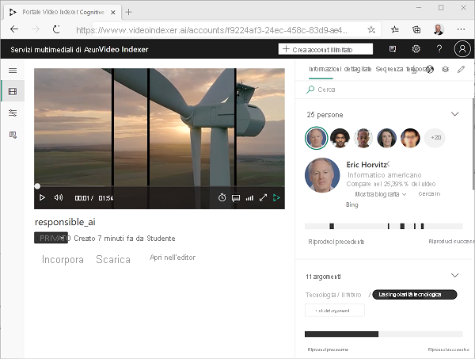
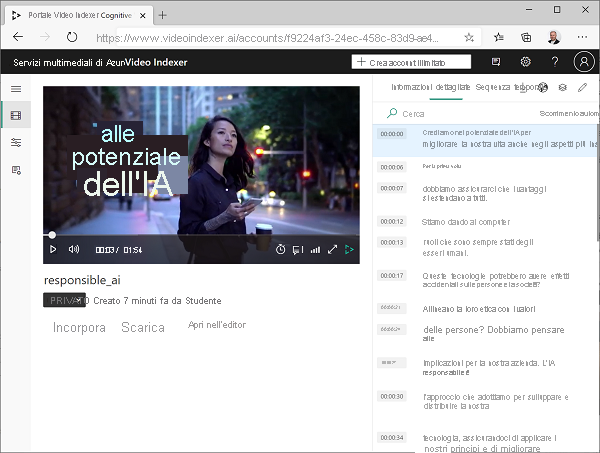
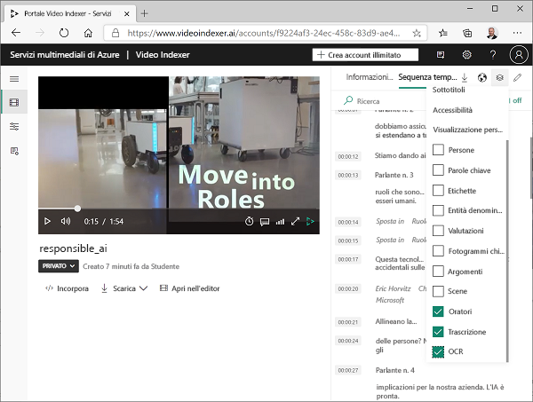
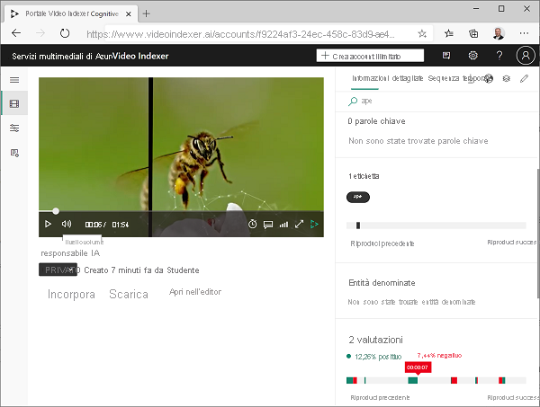
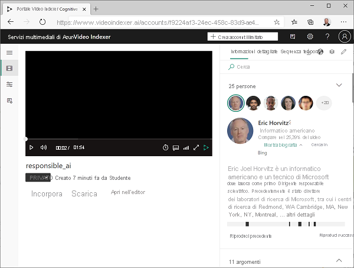
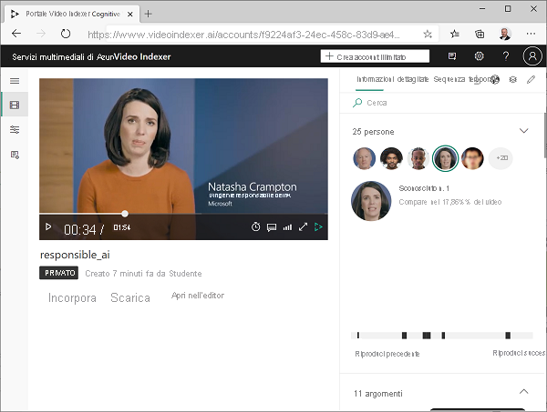
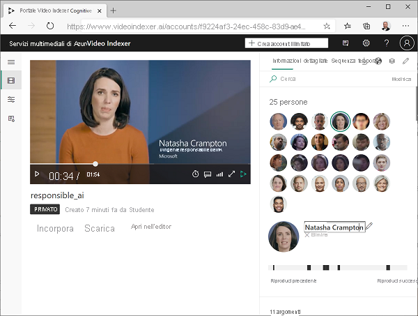
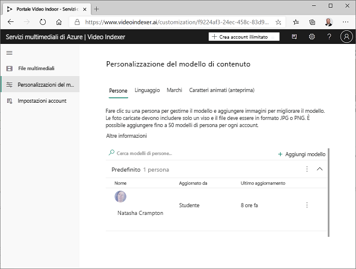
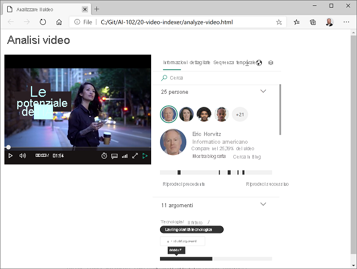

---
lab:
  title: Analizzare video con Analizzatore video
  module: Module 8 - Getting Started with Computer Vision
ms.openlocfilehash: ec23e53f363ed7c7df8fd598cfd1fc8807712f05
ms.sourcegitcommit: 7191e53bc33cda92e710d957dde4478ee2496660
ms.translationtype: HT
ms.contentlocale: it-IT
ms.lasthandoff: 07/09/2022
ms.locfileid: "147041676"
---
# Analizzare video con Analizzatore video

Gran parte dei dati creati e utilizzati oggi è in formato video. **Analizzatore video per file multimediali** è un servizio basato su intelligenza artificiale che è possibile usare per indicizzare i video ed estrarre informazioni dettagliate.

> **Nota**: Dal 21 giugno 2022 le funzionalità dei servizi cognitivi che restituiscono informazioni personali dell'utente finale sono limitate ai clienti a cui è stato concesso l'[accesso limitato](https://docs.microsoft.com/azure/cognitive-services/cognitive-services-limited-access). Inoltre, le funzionalità che deducono lo stato emotivo non sono più disponibili. Queste restrizioni possono influire sull'esecuzione di questo esercizio del lab. Stiamo lavorando per risolvere questo problema, ma nel frattempo è possibile che si riscontrino alcuni errori durante l'esecuzione della procedura seguente. Ci scusiamo per l'inconveniente. Per altre informazioni sulle modifiche apportate da Microsoft e sul relativo motivo, vedere [Misure di sicurezza e investimenti responsabili nell'intelligenza artificiale per il riconoscimento facciale](https://azure.microsoft.com/blog/responsible-ai-investments-and-safeguards-for-facial-recognition/).

## Clonare il repository per questo corso

Se è già stato clonato il repository di codice **AI-102-AIEngineer** nell'ambiente in cui si sta lavorando a questo lab, aprirlo in Visual Studio Code. In caso contrario, seguire questa procedura per clonarlo ora.

1. Avviare Visual Studio Code.
2. Aprire il riquadro comandi (MAIUSC+CTRL+P) ed eseguire un comando **Git: Clone** per clonare il repository `https://github.com/MicrosoftLearning/AI-102-AIEngineer` in una cartella locale (non importa quale).
3. Dopo la clonazione del repository, aprire la cartella in Visual Studio Code.
4. Attendere il completamento dell'installazione di file aggiuntivi per supportare i progetti in codice C# nel repository.

    > **Nota**: se viene richiesto di aggiungere gli asset necessari per la compilazione e il debug, selezionare **Non adesso**.

## Caricare un video in Analizzatore video

Prima di tutto, è necessario accedere al portale di Analizzatore video e caricare un video.

> **Suggerimento**: se il caricamento della pagina di Analizzatore video è lento nell'ambiente lab ospitato, usare il browser installato in locale. È possibile tornare alla macchina virtuale ospitata per le attività successive.

1. Nel browser aprire il portale di Analizzatore video all'indirizzo `https://www.videoindexer.ai`.
2. Se si ha già un account esistente di Analizzatore video, accedere. In caso contrario, iscriversi per ricevere un account gratuito e accedere usando l'account Microsoft (o qualsiasi altro tipo di account valido). In caso di difficoltà con l'accesso, provare ad aprire una sessione privata del browser.
3. In Analizzatore video selezionare l'opzione **Carica**. Selezionare quindi l'opzione per **immettere l'URL di un file** e immettere `https://aka.ms/responsible-ai-video`. Cambiare il nome predefinito in **Responsible AI**, esaminare le impostazioni predefinite, selezionare la casella di controllo per verificare la conformità ai criteri di Microsoft per il riconoscimento facciale, quindi caricare il file.
4. Dopo aver caricato il file, attendere alcuni minuti mentre viene indicizzato automaticamente da Analizzatore video.

> **Nota**: questo video viene usato nell'esercizio per esplorare le funzionalità di Analizzatore video, ma è consigliabile guardarlo per intero al termine dell'esercizio perché contiene informazioni e istruzioni utili per lo sviluppo responsabile di applicazioni basate su intelligenza artificiale. 

## Esaminare le informazioni dettagliate estratte dal video

Il processo di indicizzazione estrae informazioni dettagliate dal video che è possibile visualizzare nel portale.

1. Dopo l'indicizzazione del video, selezionarlo nel portale di Analizzatore video per visualizzarlo. Il lettore video verrà visualizzato insieme a un riquadro che mostra le informazioni dettagliate estratte dal video.

2. Durante la riproduzione del video, selezionare la scheda **Sequenza temporale** per visualizzare una trascrizione dell'audio.

3. In alto a destra nel portale selezionare il simbolo **Visualizza** (simile a &#128455;), quindi nell'elenco di informazioni dettagliate, oltre a **Trascrizione**, selezionare **OCR** e **Parlanti**.

4. Notare che ora il riquadro **Sequenza temporale** include quanto segue:
    - Trascrizione della narrazione audio.
    - Testo visibile nel video.
    - Indicazioni dei parlanti che compaiono nel video. Alcune persone note vengono riconosciute automaticamente per nome, mentre altre sono indicate dal numero (ad esempio *Speaker #1*).
5. Tornare nel riquadro **Informazioni dettagliate** e visualizzare le informazioni dettagliate che contiene. e comprendono:
    - Singole persone che compaiono nel video.
    - Argomenti trattati nel video.
    - Etichette per gli oggetti visualizzati nel video.
    - Entità denominate, ad esempio persone e marchi visualizzati nel video.
    - Scene chiave.
6. Con il riquadro **Informazioni dettagliate** visualizzato, selezionare di nuovo il simbolo **Visualizza**, quindi nell'elenco di informazioni dettagliate aggiungere **Parole chiave** e **Sentiment** al riquadro.

    Le informazioni dettagliate consentono di determinare i temi principali del video. Ad esempio, gli **argomenti** di questo video mostrano chiaramente che si tratta di tecnologia, responsabilità sociale ed etica.

## Cercare informazioni dettagliate

È possibile usare Analizzatore video per cercare informazioni dettagliate nel video.

1. Nella casella **Cerca** del riquadro **Informazioni dettagliate** immettere *Bee* (Ape). Può essere necessario scorrere verso il basso nel riquadro per visualizzare i risultati per tutti i tipi di informazioni dettagliate.
2. Si noti che viene trovata un'*etichetta* corrispondente, con la relativa posizione nel video indicata al di sotto.
3. Selezionare l'inizio della sezione in cui è indicata la presenza di un'ape e visualizzare il video in corrispondenza di quel punto (può essere necessario mettere in pausa il video e selezionare con attenzione: l'ape viene visualizzata solo brevemente).
4. Cancellare la casella **Cerca** per visualizzare tutte le informazioni dettagliate per il video.

## Modificare le informazioni dettagliate

È possibile usare Analizzatore video per modificare le informazioni dettagliate trovate, aggiungendo informazioni personalizzate per rendere il video ancora più significativo.

1. Riavvolgere il video all'inizio e visualizzare le **persone** elencate nella parte superiore del riquadro **Informazioni dettagliate**. Si noti che alcune persone sono state riconosciute, tra **Eric Horwitz**, un informatico e Technical Fellow presso Microsoft.

2. Selezionare la foto di Eric Horwitz, espandendo la sezione **Show biography** (Mostra biografia) per visualizzare informazioni su questa persona al di sotto.
3. Si noti che sono indicate le posizioni nel video in cui viene visualizzata la persona. È possibile usare queste indicazioni per visualizzare le sezioni specifiche del video.
4. Nel lettore video trovare la persona che parla all'incirca al minuto 0:34:

5. Si noti che questa persona non è riconosciuta e le è stato assegnato un nome generico, ad esempio **Unknown #1**. Tuttavia, il video include una didascalia con il nome di questa persona, quindi è possibile arricchire le informazioni modificando i dettagli.
6. In alto a destra nel portale selezionare l'icona **Modifica** (&#x1F589;). Cambiare quindi il nome della persona sconosciuta in **Natasha Crampton**.

7. Dopo aver cambiato il nome, cercare **Natasha** nel riquadro *Informazioni dettagliate* (Informazioni dettagliate). I risultati dovranno includere una sola persona e indicare le sezioni del video in cui compare.
8. In alto a sinistra nel portale espandere il menu (&#8801;) e selezionare la pagina **Personalizzazioni del modello**. Nella scheda **Persone** osservare quindi che nel modello di persone **Predefinito** è presente una persona. Analizzatore video ha aggiunto la persona denominata in un modello di persone, in modo che venga riconosciuta in tutti i video futuri indicizzati nell'account.

È possibile aggiungere immagini di persone al modello di persone predefinito o aggiungere nuovi modelli personalizzati. In questo modo è possibile definire raccolte di persone con immagini dei rispettivi visi che verranno riconosciute da Analizzatore video nei video.

Si noti anche che è anche possibile creare modelli personalizzati per la lingua (ad esempio per specificare la terminologia specifica del settore che si vuole venga riconosciuta da Analizzatore video) e marchi (ad esempio, nomi di società o prodotti).

## Usare i widget di Analizzatore video

Il portale di Analizzatore video è un'interfaccia utile per gestire i progetti di indicizzazione video. È tuttavia possibile che in alcuni casi si voglia rendere il video e le relative informazioni dettagliate disponibili per persone che non hanno accesso all'account di Analizzatore video. Analizzatore video prevede widget che è possibile incorporare in una pagina Web a questo scopo.

1. In Visual Studio Code, nella cartella **16-video-indexer**, aprire **analyze-video.html**. Si tratta di una pagina HTML di base a cui si aggiungeranno i widget **Player** e **Insights** di Analizzatore video. Si noti il riferimento allo script **vb.widgets.mediator.js** nell'intestazione: questo script consente l'interazione di più widget di Analizzatore video nella pagina.
2. Nel portale di Analizzatore video tornare nella pagina **File multimediali** e aprire il video **Responsible AI**.
3. Sotto il lettore video selezionare **&lt;/&gt; Incorpora** per visualizzare il codice iframe HTML per incorporare i widget.
4. Nella finestra **Incorpora e condividi** selezionare il widget **Player**, impostare le dimensioni del video su 560 x 315 e quindi copiare il codice di incorporamento negli Appunti.
5. Nel Visual Studio Code incollare il codice copiato nel file **analyze-video.html** sotto il commento **&lt;-- Player widget goes here -- &gt;** .
6. Tornare nella finestra di dialogo **Incorpora e condividi** e selezionare il widget **Insights**,quindi copiare il codice di incorporamento negli Appunti. Chiudere quindi la finestra di dialogo **Incorpora e condividi**, tornare in Visual Studio Code e incollare il codice copiato sotto il commento **&lt;-- Insights widget goes here -- &gt;** .
7. Salvare il file. Nel riquadro **Esplora risorse** fare clic con il pulsante destro del mouse su **analyze-video.html** e scegliere **Visualizza in Esplora file**.
8. In Esplora file aprire **analyze-video.html** nel browser per visualizzare la pagina Web.
9. Sperimentare con i widget, usando il widget **Insights** per cercare informazioni dettagliate e individuarle nel video.

## Usare l'API REST di Analizzatore video

Analizzatore video include un'API REST che è possibile usare per caricare e gestire i video nell'account.

### Ottenere i dettagli dell'API

Per usare l'API di Analizzatore video, sono necessarie alcune informazioni per autenticare le richieste:

1. Nel portale di Analizzatore video espandere il menu (≡) e scegliere la pagina **Impostazioni account**.
2. Prendere nota dell'**ID account** in questa pagina, perché sarà necessario più avanti.
3. Aprire una nuova scheda del browser e passare al portale per sviluppatori di Analizzatore video all'indirizzo `https://api-portal.videoindexer.ai`, accedendo con le credenziali dell'account di Analizzatore video.
4. Nella pagina **Profilo** visualizzare le **Sottoscrizioni** associate al profilo.
5. Nella pagina con le proprie sottoscrizioni si noti che sono state assegnate due chiavi (primaria e secondaria) per ognuna. Selezionare quindi **Mostra** per visualizzare una delle chiavi. Questa chiave sarà necessaria tra poco.

### Usare l'API REST

Dopo aver ottenuto l'ID account e una chiave API, è possibile usare l'API REST per lavorare con i video nell'account. In questa procedura si userà uno script di PowerShell per effettuare chiamate REST, ma gli stessi principi si applicano alle utilità HTTP, ad esempio cURL o Postman, o a qualsiasi linguaggio di programmazione in grado di inviare e ricevere codice JSON su HTTP.

Tutte le interazioni con l'API REST di Analizzatore video seguono lo stesso modello:

- Viene effettuata una richiesta iniziale al metodo **AccessToken** con la chiave API nell'intestazione per ottenere un token di accesso.
- Le richieste successive usano il token di accesso per l'autenticazione quando si chiamano i metodi REST per lavorare con i video.

1. In Visual Studio Code, nella cartella **16-video-indexer**, aprire **get-videos.ps1**.
2. Nello script di PowerShell sostituire i segnaposto **YOUR_ACCOUNT_ID** e **YOUR_API_KEY** con i valori dell'ID account e della chiave API identificati in precedenza.
3. Si noti che il valore di *location* per un account gratuito è "trial". Se è stato creato un account di Analizzatore video senza restrizioni (con una risorsa di Azure associata), è possibile cambiare questa località impostando l'area di Azure in cui è stato effettuato il provisioning della risorsa di Azure, ad esempio "eastus".
4. Esaminare il codice dello script, notando che richiama due metodi REST: uno per ottenere un token di accesso e un altro per elencare i video presenti nell'account.
5. Salvare le modifiche e quindi in alto a destra nel riquadro di script usare il pulsante **&#9655;** per eseguire lo script.
6. Visualizzare la risposta JSON dal servizio REST, che dovrà contenere i dettagli del video **Responsible AI** indicizzato in precedenza.

## Altre informazioni

Per altre informazioni su **Analizzatore video**, vedere la [documentazione di Analizzatore video](https://docs.microsoft.com/azure/azure-video-analyzer/video-analyzer-for-media-docs/).
