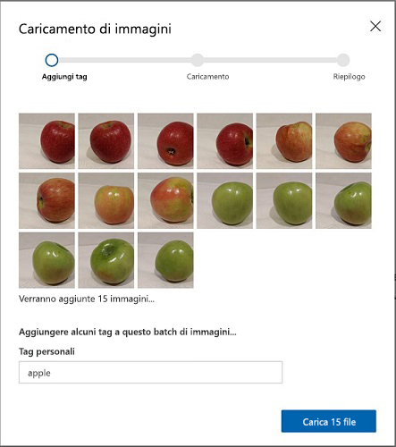
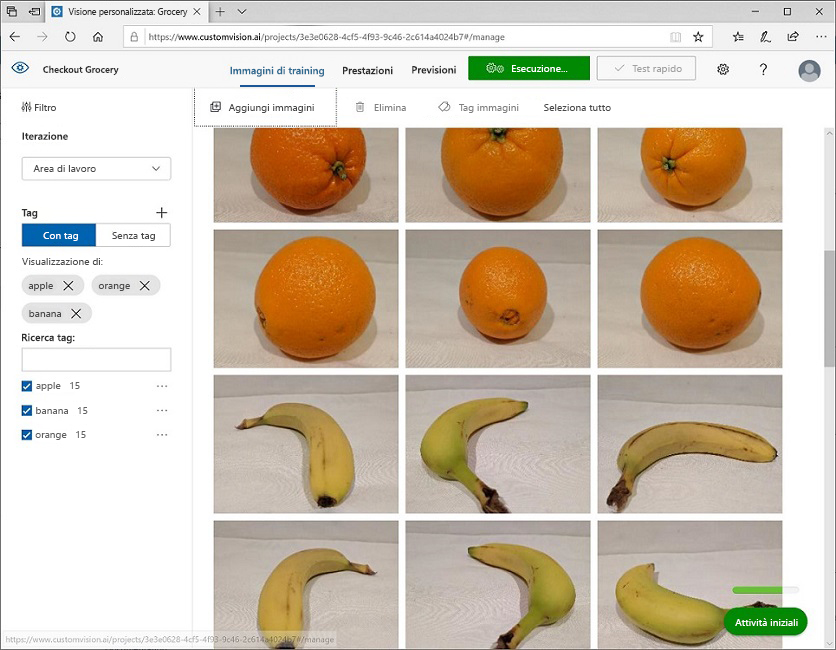
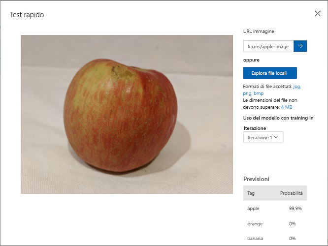

---
lab:
  title: Classificare immagini con Visione personalizzata
  module: Module 9 - Developing Custom Vision Solutions
ms.openlocfilehash: bcc13ab51244348448c36cd38788263e7d32ba89
ms.sourcegitcommit: d6da3bcb25d1cff0edacd759e75b7608a4694f03
ms.translationtype: HT
ms.contentlocale: it-IT
ms.lasthandoff: 11/16/2021
ms.locfileid: "132625970"
---
# <a name="classify-images-with-custom-vision"></a>Classificare immagini con Visione personalizzata

Il servizio **Visione personalizzata** consente di creare modelli di visione artificiale di cui è stato eseguito il training sulle proprie immagini. È possibile usarlo per eseguire il training dei modelli di *classificazione immagini* e *rilevamento oggetti*, che è poi possibile pubblicare e utilizzare nelle applicazioni.

In questo esercizio si userà il servizio Visione personalizzata per eseguire il training di un modello di classificazione immagini in grado di identificare tre classi di frutti (mela, banana e arancia).

## <a name="clone-the-repository-for-this-course"></a>Clonare il repository per questo corso

Se il repository di codice **AI-102-AIEngineer** non è già stato clonato nell'ambiente in cui si sta lavorando a questo lab, seguire questa procedura per clonarlo. In caso contrario, aprire la cartella clonata in Visual Studio Code.

1. Avviare Visual Studio Code.
2. Aprire il riquadro comandi (MAIUSC+CTRL+P) ed eseguire un comando **Git: Clone** per clonare il repository `https://github.com/MicrosoftLearning/AI-102-AIEngineer` in una cartella locale. Non è importante usare una cartella specifica.
3. Dopo la clonazione del repository, aprire la cartella in Visual Studio Code.
4. Attendere il completamento dell'installazione di file aggiuntivi per supportare i progetti in codice C# nel repository.

    > **Nota**: se viene richiesto di aggiungere gli asset necessari per la compilazione e il debug, selezionare **Non adesso**.

## <a name="create-custom-vision-resources"></a>Creare risorse di Visione personalizzata

Per poter eseguire il training di un modello, sono necessarie le risorse di Azure per il *training e* la *previsione*. È possibile creare risorse di **Visione personalizzata** per ognuna di queste attività oppure creare una singola risorsa di **Servizi cognitivi** e usarla per uno o entrambi.

In questo esercizio si creeranno le risorse di **Visione personalizzata** per il training e la previsione in modo che sia possibile gestire l'accesso e i costi di questi carichi di lavoro separatamente.

1. In una nuova scheda del browser aprire il portale di Azure all'indirizzo `https://portal.azure.com` ed eseguire l'accesso usando l'account Microsoft associato alla sottoscrizione di Azure.
2. Selezionare il pulsante **&#65291;Crea una risorsa**, cercare *visione personalizzata* e creare una risorsa di **Visione personalizzata** con le impostazioni seguenti:
    - **Opzioni di creazione**: Entrambi
    - **Sottoscrizione**: *la propria sottoscrizione di Azure*
    - **Gruppo di risorse**: *scegliere o creare un gruppo di risorse. Se si usa una sottoscrizione con restrizioni, si potrebbe non essere autorizzati a creare un nuovo gruppo di risorse. Usare quello fornito*
    - **Nome**: *immettere un nome univoco*
    - **Percorso di training**: *scegliere una qualsiasi area geografica disponibile*
    - **Piano tariffario per il training**: F0
    - **Percorso di stima**: *la stessa area geografica della risorsa di training*
    - **Piano tariffario per le previsioni**: F0

    > **Nota**: se è già disponibile un servizio di visione personalizzata F0 nella sottoscrizione in uso, selezionare **S0**.

3. Attendere che le risorse vengano create, quindi visualizzare i dettagli di distribuzione e tenere presente che verrà eseguito il provisioning di due risorse di Visione personalizzata: una per il training e un'altra per la previsione. È possibile visualizzarle accedendo al gruppo di risorse in cui sono state create.

> **Importante**: per ogni risorsa sono disponibili un *endpoint* e *chiavi* specifiche, che vengono usati per gestire l'accesso dal codice. Per eseguire il training di un modello di classificazione immagini, il codice deve usare la risorsa di *training* (con l'endpoint e la chiave corrispondenti). Per usare il modello con training per prevedere le classi di immagini, il codice deve usare la risorsa di *previsione* (con l'endpoint e la chiave corrispondenti).

## <a name="create-a-custom-vision-project"></a>Creare un progetto di Visione personalizzata

Per eseguire il training di un modello di classificazione immagini, è necessario creare un progetto Visione personalizzata basato sulla risorsa di training. Per farlo, verrà usato il portale Custom Vision (Visione personalizzata).

1. In Visual Studio Code visualizzare le immagini di training nella cartella **17-image-classification/training-images** in cui è stato clonato il repository. Questa cartella contiene sottocartelle di immagini di mele, banane e arance.
2. In una nuova scheda del browser aprire il portale di Visione personalizzata all'indirizzo `https://customvision.ai`. Se richiesto, eseguire l'accesso usando l'account Microsoft associato alla sottoscrizione di Azure e accettare i termini del servizio.
3. Nel portale Custom Vision (Visione personalizzata) creare un nuovo progetto con le impostazioni seguenti:
    - **Nome**: Classify Fruit
    - **Descrizione**: Image classification for fruit
    - **Risorsa**: *la risorsa di Visione personalizzata creata in precedenza*
    - **Tipi di progetto**: Classe
    - **Tipi di classificazione**: Multiclasse (un tag per immagine)
    - **Domini**: Food
4. Nel nuovo progetto fare clic su **\[+\] Aggiungi immagini** e selezionare tutti i file della cartella **training-images/apple** visualizzata in precedenza. Caricare quindi i file di immagine specificando il tag *apple*, come di seguito:


   
5. Ripetere il passaggio precedente per caricare le immagini nella cartella **banana** con il tag *banana*, e le immagini nella cartella **orange** con il tag *orange*.
6. Esplorare le immagini che hai caricato nel progetto Visione personalizzata. Dovrebbero essere presenti 15 immagini di ogni classe, come di seguito:


    
7. Nel progetto Visione personalizzata, sopra le immagini, fare clic su **Train** (Esegui il training) per eseguire il training di un modello di classificazione usando le immagini con tag. Selezionare l'opzione **Quick Training** (Training rapido) e quindi attendere che l'iterazione del training venga completata (potrebbe essere necessario un minuto circa).
8. Al termine del training dell'iterazione del modello, esaminare le metriche di prestazione *Precision* (Precisione), *Recall* (Richiamo) e *AP*, che misurano l'accuratezza della previsione del modello di classificazione e dovrebbero essere tutte elevate.

> **Nota**: le metriche delle prestazioni sono basate su una soglia di probabilità del 50% per ogni previsione. In altre parole, se il modello calcola una probabilità di almeno il 50% che un'immagine appartenga a una specifica classe, viene prevista tale classe. È possibile modificare questa impostazione in alto a sinistra nella pagina.

## <a name="test-the-model"></a>Testare il modello

Ora che è stato eseguito il training del modello, è possibile testarlo.

1. Sopra le metriche di prestazione, fare clic su **Quick Test** (Test rapido).
2. Nella casella **URL immagine** digitare `https://aka.ms/apple-image` e fare clic su &#10132;
3. Visualizzare le previsioni restituite dal modello: il punteggio di probabilità per *apple* dovrebbe essere il più alto, come di seguito:



4. Chiudere la finestra **Quick Test** (Test rapido).

## <a name="view-the-project-settings"></a>Visualizzare le impostazioni del progetto

Al progetto creato è stato assegnato un identificatore univoco, che sarà necessario specificare in qualsiasi codice con cui interagisce.

1. Fare clic sull'icona delle *impostazioni* (&#9881;) in alto a destra nella pagina **Prestazioni** per visualizzare le impostazioni del progetto.
2. In **Generale** (sulla sinistra) prendere nota del valore di **ID progetto** che identifica in modo univoco questo progetto.
3. Sulla destra, notare che in **Risorse** sono visualizzati i dettagli relativi alla risorsa di *training*, inclusi la chiave e l'endpoint. È anche possibile ottenere queste informazioni visualizzando la risorsa nel portale di Azure.

## <a name="use-the-training-api"></a>Usare l'API di *training*

Il portale di Visione personalizzata offre una pratica interfaccia utente che è possibile usare per caricare e contrassegnare le immagini ed eseguire il training dei modelli. Tuttavia, in alcuni scenari può essere necessario automatizzare il training dei modelli usando l'API di training di Visione personalizzata.

> **Nota**: in questo esercizio è possibile scegliere se usare l'API dall'SDK **C#** o **Python**. Nella procedura seguente eseguire le azioni appropriate per il linguaggio scelto.

1. Nel riquadro **Esplora risorse** di Visual Studio Code passare alla cartella **17mage_classification** ed espandere la cartella **C-Sharp** o **Python** in base al linguaggio scelto.
2. Fare clic con il pulsante destro del mouse sulla cartella **train-classifier** e aprire un terminale integrato. Installare quindi il pacchetto Training di Visione personalizzata eseguendo il comando appropriato per il linguaggio scelto:

**C#**

```
dotnet add package Microsoft.Azure.CognitiveServices.Vision.CustomVision.Training --version 2.0.0
```

**Python**

```
pip install azure-cognitiveservices-vision-customvision==3.1.0
```

3. Visualizzare il contenuto della cartella **train-classifier** e notare che include un file per le impostazioni di configurazione:
    - **C#** : appsettings.json
    - **Python**: .env

    Aprire il file di configurazione e aggiornare i valori di configurazione in esso contenuti in modo che corrispondano all'endpoint e alla chiave per la risorsa di *training* di Visione personalizzata e all'ID progetto per il progetto di classificazione creato in precedenza. Salvare le modifiche.
4. Si noti che la cartella **train-classifier** contiene un file di codice per l'applicazione client:

    - **C#** : Program.cs
    - **Python**: train-classifier.py

    Aprire il file di codice ed esaminare il codice in esso contenuto, notando i dettagli seguenti:
    - Gli spazi dei nomi del pacchetto installato vengono importati
    - La funzione **Main** recupera le impostazioni di configurazione e usa la chiave e l'endpoint per creare un oggetto **CustomVisionTrainingClient** autenticato, che viene quindi usato con l'ID progetto per creare un riferimento **Project** al progetto.
    - La finzione **Upload_Images** recupera i tag definiti nel progetto Visione personalizzata e quindi carica i file di immagine dalle cartelle denominate corrispondenti al progetto, assegnando l'ID tag appropriato.
    - La funzione **Train_Model** crea una nuova iterazione di training per il progetto e attende il completamento del training.
5. Tornare nel terminale integrato per la cartella **train-classifier**, quindi immettere il comando seguente per eseguire il programma:

**C#**

```
dotnet run
```

**Python**

```
python train-classifier.py
```
    
6. Attendere il completamento del programma. Tornare quindi al browser e visualizzare la pagina **Immagini training** per il progetto nel portale di Visione personalizzata, se necessario aggiornando il browser.
7. Verificare che alcune nuove immagini con tag siano state aggiunte al progetto. Visualizzare quindi la pagina **Prestazioni** e verificare che sia stata creata una nuova iterazione.

## <a name="publish-the-image-classification-model"></a>Pubblicare il modello di classificazione immagini

A questo punto è possibile pubblicare il modello con training per poterlo usare da un'applicazione client.

1. Nella pagina **Prestazioni** del portale di Visione personalizzata fare clic su **&#128504; Pubblica** per pubblicare il modello con training con le impostazioni seguenti:
    - **Nome del modello**: fruit-classifier
    - **Risorsa di previsione**: *la risorsa di **previsione** creata in precedenza (<u>non</u> la risorsa di training)* .
2. In alto a sinistra nella pagina **Impostazioni progetto** fare clic sull'icona *Projects Gallery* (Raccolta progetti) (&#128065;) per tornare alla pagina iniziale del portale di Visione personalizzata in cui è ora elencato il progetto appena creato.
3. In alto a destra nella pagina iniziale del portale di Visione personalizzata fare clic sull'icona delle *impostazioni* (&#9881;) per visualizzare le impostazioni del servizio Visione personalizzata. In **Risorse** individuare la risorsa di *previsione* (<u>non</u> la risorsa di training) per determinare i valori di **Chiave** ed **Endpoint**. È anche possibile ottenere queste informazioni visualizzando la risorsa nel portale di Azure.

## <a name="use-the-image-classifier-from-a-client-application"></a>Usare il classificatore di immagini da un'applicazione client

A questo punto, dopo aver pubblicato il modello di classificazione immagini, è possibile usarlo da un'applicazione client. Anche questa volta, è possibile scegliere di usare **C#** o **Python**.

1. In Visual Studio Code, nella cartella **17-image-classification**, nella sottocartella del linguaggio scelto (**C-Sharp** o **Python**), fare clic con il pulsante destro del mouse sulla cartella **test-classifier** e aprire un terminale integrato. Immettere quindi il comando specifico dell'SDK seguente per installare il pacchetto Previsione di Visione personalizzata:

**C#**

```
dotnet add package Microsoft.Azure.CognitiveServices.Vision.CustomVision.Prediction --version 2.0.0
```

**Python**

```
pip install azure-cognitiveservices-vision-customvision==3.1.0
```

> **Nota**: il pacchetto Python SDK include sia pacchetti di training che di previsione e potrebbe essere già installato.

2. Espandere la cartella **test-classifier** per visualizzare i file che contiene, usati per implementare un'applicazione client di test per il modello di classificazione immagini.
3. Aprire il file di configurazione dell'applicazione client (*appsettings.json* per C# o *.env* per Python) e aggiornare i valori di configurazione che contiene in modo che rispecchino l'endpoint e la chiave per la risorsa di *previsione* di Visione personalizzata, l'ID del progetto di classificazione e il nome del modello pubblicato (che dovrà essere *fruit-classifier*). Salvare le modifiche.
4. Aprire il file di codice per l'applicazione client (*Program.cs* per C#, *test-classification.py* per Python) ed esaminare il codice notando i dettagli seguenti:
    - Gli spazi dei nomi del pacchetto installato vengono importati
    - La funzione **Main** recupera le impostazioni di configurazione e usa la chiave e l'endpoint per creare un oggetto **CustomVisionPredictionClient** autenticato.
    - L'oggetto client di previsione viene usato per prevedere una classe per ogni immagine della cartella **test-images**, specificando l'ID progetto e il nome del modello per ogni richiesta. Ogni previsione include una probabilità per ogni classe possibile e vengono visualizzati solo i tag previsi con una probabilità maggiore del 50%.
5. Tornare nel terminale integrato per la cartella **train-classifier**, quindi immettere il comando specifico dell'SDK seguente per eseguire il programma:

**C#**

```
dotnet run
```

**Python**

```
python test-classifier.py
```

6. Visualizzare l'etichetta (tag) e i punteggi di probabilità per ogni previsione. È possibile visualizzare le immagini nella cartella **test-images** per verificare che il modello le abbia classificate correttamente.

## <a name="more-information"></a>Altre informazioni

Per altre informazioni sulla classificazione immagini con il servizio Visione personalizzata, vedere la [documentazione di Visione personalizzata](https://docs.microsoft.com/azure/cognitive-services/custom-vision-service/).
