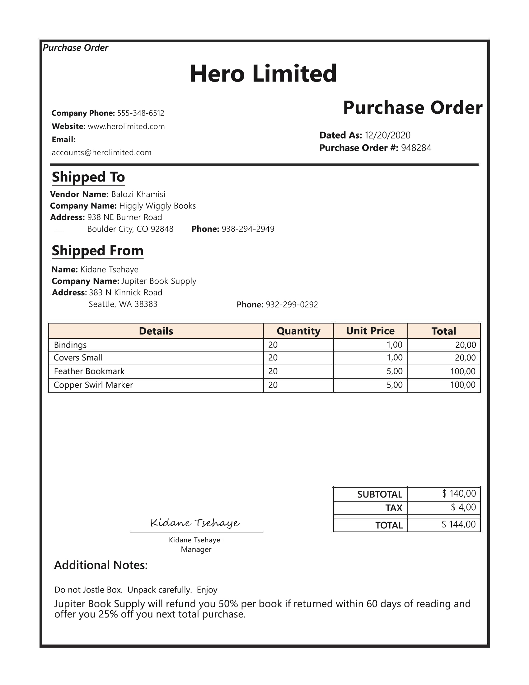
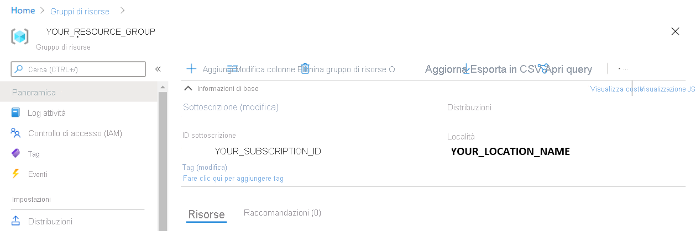

---
lab:
  title: Estrarre dati dai moduli
  module: Module 11 - Reading Text in Images and Documents
ms.openlocfilehash: e2181d06b7dbf14bb5ea2a850eeb39d80a575f61
ms.sourcegitcommit: 254d3fe43a77d925ba3bfb81daae737ec8203bfa
ms.translationtype: HT
ms.contentlocale: it-IT
ms.lasthandoff: 12/07/2021
ms.locfileid: "133893548"
---
# <a name="extract-data-from-forms"></a>Estrarre dati dai moduli 

Si supponga che un'azienda debba automatizzare un processo di immissione dei dati. Attualmente un dipendente potrebbe leggere manualmente un ordine di acquisto e immettere i dati in un database. Si vuole compilare un modello che userà Machine Learning per leggere il modulo e produrre dati strutturati che possono essere usati per aggiornare automaticamente un database.

**Riconoscimento modulo** è un servizio cognitivo che consente agli utenti di creare software di elaborazione dati automatizzata. Questo software può estrarre testo, coppie chiave/valore e tabelle dai documenti modulo usando il riconoscimento ottico dei caratteri (OCR). Riconoscimento modulo ha modelli predefiniti per il riconoscimento di fatture, ricevute e biglietti da visita. Il servizio offre anche la possibilità di eseguire il training di modelli personalizzati. Questo esercizio si concentrerà sulla creazione di modelli personalizzati.

## <a name="clone-the-repository-for-this-course"></a>Clonare il repository per questo corso

Se non è già stato fatto, è necessario clonare il repository di codice per questo corso:

1. Avviare Visual Studio Code.
2. Aprire il riquadro comandi (MAIUSC+CTRL+P) ed eseguire un comando **Git: Clone** per clonare il repository `https://github.com/MicrosoftLearning/AI-102-AIEngineer` in una cartella locale (non importa quale).
3. Dopo la clonazione del repository, aprire la cartella in Visual Studio Code.
4. Attendere il completamento dell'installazione di file aggiuntivi per supportare i progetti in codice C# nel repository.

    > **Nota**: se viene richiesto di aggiungere gli asset necessari per la compilazione e il debug, selezionare **Non adesso**.

## <a name="create-a-form-recognizer-resource"></a>Creare una risorsa di riconoscimento modulo

Per usare il servizio Riconoscimento modulo è necessaria una risorsa di Riconoscimento modulo nella sottoscrizione di Azure. Si userà il portale di Azure per creare una risorsa.

1.  Aprire il portale di Azure all'indirizzo `https://portal.azure.com` ed eseguire l'accesso usando l'account Microsoft associato alla sottoscrizione di Azure.

2. Selezionare il pulsante **&#65291;Crea una risorsa**, cercare *Riconoscimento modulo* e creare una risorsa di **Riconoscimento modulo** con le impostazioni seguenti:
    - **Sottoscrizione**: *la propria sottoscrizione di Azure*
    - **Gruppo di risorse**: *scegliere o creare un gruppo di risorse. Se si usa una sottoscrizione con restrizioni, si potrebbe non essere autorizzati a creare un nuovo gruppo di risorse. Usare quello fornito*
    - **Area**: *scegliere una qualsiasi area disponibile*
    - **Nome**: *immettere un nome univoco*
    - **Piano tariffario**: F0

    > **Nota**: se è già disponibile un servizio Riconoscimento modulo F0 nella sottoscrizione in uso, selezionare **S0**.

3. Al termine della distribuzione, passare alla risorsa e visualizzare la rispettiva pagina **Chiavi ed endpoint**. Saranno necessari l'**endpoint** e una delle **chiavi** di questa pagina per gestire l'accesso dal codice in un secondo momento. 

## <a name="gather-documents-for-training"></a>Raccogliere documenti per il training

  

Si useranno i moduli di esempio della cartella **21-custom-form/sample-forms** in questo repository, che contengono tutti i file necessari per eseguire il training di un modello senza etichette e di un altro modello con etichette.

1. In Visual Studio Code, nella cartella **21-custom-form** espandere la cartella **sample-forms**. Si noti che sono presenti file che terminano con **.json** e **.jpg** nella cartella.

    Si useranno i file **.jpg** per eseguire il training del primo modello _senza_ etichette.  

    Successivamente si useranno i file che terminano con **.json** e **.jpg** per eseguire il training del secondo modello _con_ etichette. I **file .json** sono stati generati automaticamente e contengono informazioni sull'etichetta. Per eseguire il training con le etichette, è necessario avere i file di informazioni sulle etichette nel contenitore di archiviazione BLOB insieme ai moduli. 

2. Tornare al portale di Azure all'indirizzo [https://portal.azure.com](https://portal.azure.com).

3. Visualizzare il **gruppo di risorse** in cui è stata creata la risorsa di Riconoscimento modulo.

4. Nella pagina **Panoramica** per il gruppo di risorse prendere nota dei valori di **ID sottoscrizione** e **Località**. Questi valori saranno necessari nei passaggi successivi, insieme al nome del **gruppo di risorse**.



5. Nel riquadro Explorer di Visual Studio Code fare clic con il pulsante destro del mouse sulla cartella **21-custom-form** e scegliere **Apri nel terminale integrato**.

6. Nel riquadro del terminale immettere il comando seguente per stabilire una connessione autenticata alla sottoscrizione di Azure.
    
```
az login --output none
```

7. Quando verrà richiesto, accedere alla sottoscrizione di Azure. Tornare quindi a Visual Studio Code e attendere il completamento del processo di accesso.

8. Eseguire il comando seguente per elencare le località di Azure.

```
az account list-locations -o table
```

9. Nell'output individuare il valore **Name** corrispondente alla località del gruppo di risorse (ad esempio per *Stati Uniti orientali* il nome corrispondente è *eastus*).

    > **Importante**: registrare il valore **Name** e usarlo nel passaggio 12.

10. Nella cartella **21-custom-form** del riquadro Explorer selezionare **setup.cmd**. Questo script batch verrà usato per eseguire i comandi dell'interfaccia della riga di comando di Azure che consentono di creare le altre risorse di Azure necessarie.

11. Nello script **setup.cmd** esaminare i comandi **rem**. Questi commenti illustrano il programma che verrà eseguito dallo script. Il programma: 
    - Creerà un account di archiviazione nel gruppo di risorse di Azure
    - Caricherà file dalla cartella _sampleforms_ locale in un contenitore denominato _sampleforms_ nell'account di archiviazione
    - Stamperà un URI di firma di accesso condiviso

12. Modificare le dichiarazioni di variabile **subscription_id**, **resource_group** e **location** con i valori appropriati per la sottoscrizione, il gruppo di risorse e il nome della posizione in cui è stata distribuita la risorsa di Riconoscimento modulo. **Salvare** quindi le modifiche.

    Lasciare la variabile **expiry_date** così come è per l'esercizio. Questa variabile viene usata durante la generazione dell'URI della firma di accesso condiviso. In pratica è necessario impostare una data di scadenza appropriata per la firma di accesso condiviso. Per altre informazioni sulla firma di accesso condiviso, fare clic [qui](https://docs.microsoft.com/azure/storage/common/storage-sas-overview#how-a-shared-access-signature-works).  

13. Nel terminale per la cartella **21-custom-form** immettere il comando seguente per eseguire lo script:

```
setup
```

14. Al termine dello script, esaminare l'output visualizzato e prendere nota dell'URI di firma di accesso condiviso della risorsa di Azure.

> **Importante**: prima di procedere, incollare l'URI di firma di accesso condiviso in un punto in cui sarà possibile recuperarlo nuovamente in un secondo momento, ad esempio in un nuovo file di testo in Visual Studio Code.

15. Nel portale di Azure aggiornare il gruppo di risorse e verificare che contenga l'account di archiviazione di Azure appena creato. Aprire l'account di archiviazione e nel riquadro a sinistra selezionare **Browser archiviazione (anteprima)** . Nel browser archiviazione espandere **CONTENITORI BLOB** e selezionare il contenitore **sampleforms** per verificare che i file siano stati caricati dalla cartella **21-custom-form/sample-forms** locale.

## <a name="train-a-model-without-labels"></a>Eseguire il training di un modello *senza* etichette

Si userà il Form Recognizer SDK per eseguire il training e il test di un modello personalizzato.  

> **Nota**: in questo esercizio è possibile scegliere se usare l'API dall'SDK **C#** o **Python**. Nella procedura seguente eseguire le azioni appropriate per il linguaggio scelto.

1. Nella cartella **21-custom-form** in Visual Studio Code espandere la cartella **C-Sharp** o **Python** in base al linguaggio scelto.
2. Fare clic con il pulsante destro del mouse sulla cartella **train-model** e aprire un terminale integrato.

3. Installare quindi il pacchetto Riconoscimento modulo eseguendo il comando appropriato per il linguaggio scelto:

**C#**

```
dotnet add package Azure.AI.FormRecognizer --version 3.0.0 
```

**Python**

```
pip install azure-ai-formrecognizer==3.0.0
```

3. Visualizzare i contenuti della cartella **train-model** e notare che include un file per le impostazioni di configurazione:
    - **C#** : appsettings.json
    - **Python**: .env

4. Modificare il file di configurazione modificando le impostazioni in modo che riflettano:
    - L'**endpoint** per la risorsa di Riconoscimento modulo.
    - Una **chiave** per la risorsa di Riconoscimento modulo.
    - L'**URI di firma di accesso condiviso** per il contenitore BLOB.

5. Si noti che la cartella **train-model** contiene un file di codice per l'applicazione client:

    - **C#** : Program.cs
    - **Python**: train-model.py

    Aprire il file di codice ed esaminare il codice in esso contenuto, notando i dettagli seguenti:
    - Gli spazi dei nomi del pacchetto installato vengono importati
    - La funzione **Main** recupera le impostazioni di configurazione e usa la chiave e l'endpoint per creare un **client** autenticato.
    - Il codice usa il client di training per eseguire il training di un modello usando le immagini nel contenitore di archiviazione BLOB, a cui si accede usando l'URI di firma di accesso condiviso generato.
    - Il training viene eseguito con un parametro per indicare che le etichette di training <u>non</u> devono essere usate. Riconoscimento modulo usa una tecnica *senza supervisione* per estrarre i campi dalle immagini del modulo.

6. Tornare al terminale integrato per la cartella **train-model**, quindi immettere il comando seguente per eseguire il programma:

**C#**

```
dotnet run
```

**Python**

```
python train-model.py
```

7. Attendere il completamento del programma. Esaminare quindi l'output del modello e trovare l'ID modello nel terminale. Questo valore sarà necessario nella procedura successiva, quindi non chiudere il terminale.

## <a name="test-the-model-created-without-labels"></a>Testare il modello creato senza etichette

A questo punto è possibile usare il modello con training. Si noti come sia stato eseguito il training del modello usando i file da un URI del contenitore di archiviazione. È anche possibile eseguire il training del modello usando file locali. Analogamente è possibile testare il modello usando moduli da un URI o da file locali. Il modello di modulo verrà testato con un file locale.

Dopo aver ottenuto l'ID modello, è possibile usarlo da un'applicazione client. Anche questa volta, è possibile scegliere di usare **C#** o **Python**.

1. Nella cartella **21-custom-form**, nella sottocartella del linguaggio preferito (**C-Sharp** o **Python**), espandere la cartella **test-model**.
2. Fare clic con il pulsante destro del mouse sulla cartella **test-model** e aprire un terminale integrato. Sono ora disponibili almeno due terminali **cmd** ed è possibile passare da un terminale all'altro usando l'elenco a discesa nel riquadro Terminale.
3. Nel terminale per la cartella **test-model** installare il pacchetto Riconoscimento modulo eseguendo il comando appropriato per il linguaggio scelto:

**C#**

```
dotnet add package Azure.AI.FormRecognizer --version 3.0.0 
```

**Python**

```
pip install azure-ai-formrecognizer==3.0.0
```

*Questa operazione non è strettamente necessaria se in precedenza è stato usato pip per installare il pacchetto nell'ambiente Python, ma è opportuno assicurarsi che sia installato.*

4. Nella cartella **test-model** modificare il file di configurazione (**appsettings.json** o **.env**, a seconda delle preferenze di linguaggio) per aggiungere i valori seguenti:
    - L'endpoint di Riconoscimento modulo.
    - La chiave di Riconoscimento modulo.
    - L'ID modello generato durante il training del modello. È possibile trovarlo riportando il terminale alla console **cmd** per la cartella **train-model**.

5. Nella cartella **test-model** aprire il file di codice per l'applicazione client (*Program.cs* per C#, *test-model.py* per Python) ed esaminare il codice in esso contenuto, notando i dettagli seguenti:
    - Gli spazi dei nomi del pacchetto installato vengono importati
    - La funzione **Main** recupera le impostazioni di configurazione e usa la chiave e l'endpoint per creare un **client** autenticato.
    - Il client viene quindi usato per estrarre i campi e i valori del modulo dall'immagine **test1.jpg**.
    
6. Tornare al terminale integrato per la cartella **test-model**, quindi immettere il comando seguente per eseguire il programma:

**C#**

```
dotnet run
```

**Python**

```
python test-model.py
```

7. Visualizzare l'output e notare i punteggi di attendibilità della stima. Si noti che l'output fornisce nomi di campo field-1, field-2 e così via. 

## <a name="train-a-model-with-labels-using-the-client-library"></a>Eseguire il training di un modello *con* etichette usando la libreria client

Si supponga che dopo aver eseguito il training di un modello con i moduli della fattura si voglia vedere come viene eseguito il training di un modello sui dati con etichetta. Quando si è eseguito il training di un modello senza etichette, sono stati usati moduli **.jpg** del contenitore BLOB di Azure. A questo punto si eseguirà il training di un modello usando i file **.jpg** e **.json**.

1. Nella cartella **21-custom-form/sample-forms** in Visual Studio Code aprire **fields.json** ed esaminare il documento JSON in esso contenuto. Questo file definisce i campi di cui eseguire il training di un modello per l'estrazione dai moduli.
2. Aprire **Form_1.jpg.labels.json** ed esaminare il codice JSON in esso contenuto. Questo file identifica il percorso e i valori per i campi denominati nel documento di training **Form_1.jpg**.
3. Aprire **Form_1.jpg.ocr.json** ed esaminare il codice JSON in esso contenuto. Questo file contiene una rappresentazione JSON del layout del testo di **Form_1.jpg**, inclusa la posizione di tutte le aree di testo presenti nel modulo.

    *In questo esercizio sono stati forniti i file di informazioni sul campo. Per i propri progetti, è possibile creare questi file usando lo [strumento di etichettatura di esempio](https://docs.microsoft.com/azure/cognitive-services/form-recognizer/label-tool). Quando si usa lo strumento, i file di informazioni sul campo vengono creati e archiviati automaticamente nell'account di archiviazione connesso.*

4. Nella cartella **train-model** aprire il file di codice per l'applicazione di training:

    - **C#** : Program.cs
    - **Python**: train-model.py

5. Nella funzione **Main** trovare il commento **Train model** e modificarlo come illustrato per modificare il processo di training in modo che le etichette vengano usate:

**C#**

```C#
// Train model 
CustomFormModel model = await trainingClient
.StartTrainingAsync(new Uri(trainingStorageUri), useTrainingLabels: true)
.WaitForCompletionAsync();
```

**Python**

```Python
# Train model 
poller = form_training_client.begin_training(trainingDataUrl, use_training_labels=True)
model = poller.result()
```

6. Tornare al terminale integrato per la cartella **train-model**, quindi immettere il comando seguente per eseguire il programma:

**C#**

```
dotnet run
```

**Python**

```
python train-model.py
```

10. Attendere la fine del programma, quindi esaminare l'output del modello.
11. Si noti il nuovo ID modello nell'output del terminale. 

## <a name="test-the-model-created-with-labels"></a>Testare il modello creato con etichette

1. Nella cartella **test-model** modificare il file di configurazione (**appsettings.json** o **.env**, a seconda delle preferenze di linguaggio) e aggiornarlo per riflettere il nuovo ID modello. Salvare le modifiche.
2. Tornare al terminale integrato per la cartella **test-model**, quindi immettere il comando seguente per eseguire il programma:

**C#**

```
dotnet run
```

**Python**

```
python test-model.py
```
    
3. Visualizzare l'output e osservare come l'output per il modello con training **con** etichette fornisce nomi di campo come "CompanyPhoneNumber" e "DatedAs" a differenza dell'output del modello con training **senza** etichette, che ha generato un output di field-1, field-2 e così via.  

Anche se il codice del programma per il training di un modello _con_ etichette potrebbe non differire notevolmente dal codice per il training _senza_ etichette, la scelta di uno rispetto all'altro _modifica_ le esigenze di pianificazione del progetto. Per eseguire il training con le etichette, è necessario [creare i file con etichetta](https://docs.microsoft.com/azure/cognitive-services/form-recognizer/quickstarts/label-tool?tabs=v2-0). La scelta del processo di training può anche produrre modelli diversi, che a loro volta possono influire sui processi downstream in base ai campi restituiti dal modello e alla sicurezza dei valori restituiti. 

## <a name="more-information"></a>Altre informazioni

Per ulteriori informazioni sul servizio Riconoscimento modulo, vedere la [documentazione di Riconoscimento modulo](https://docs.microsoft.com/azure/cognitive-services/form-recognizer/).
